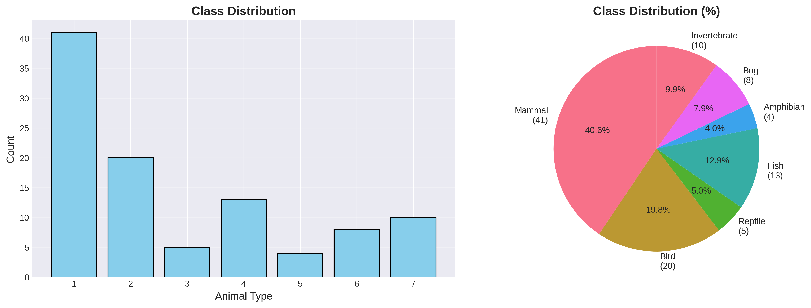
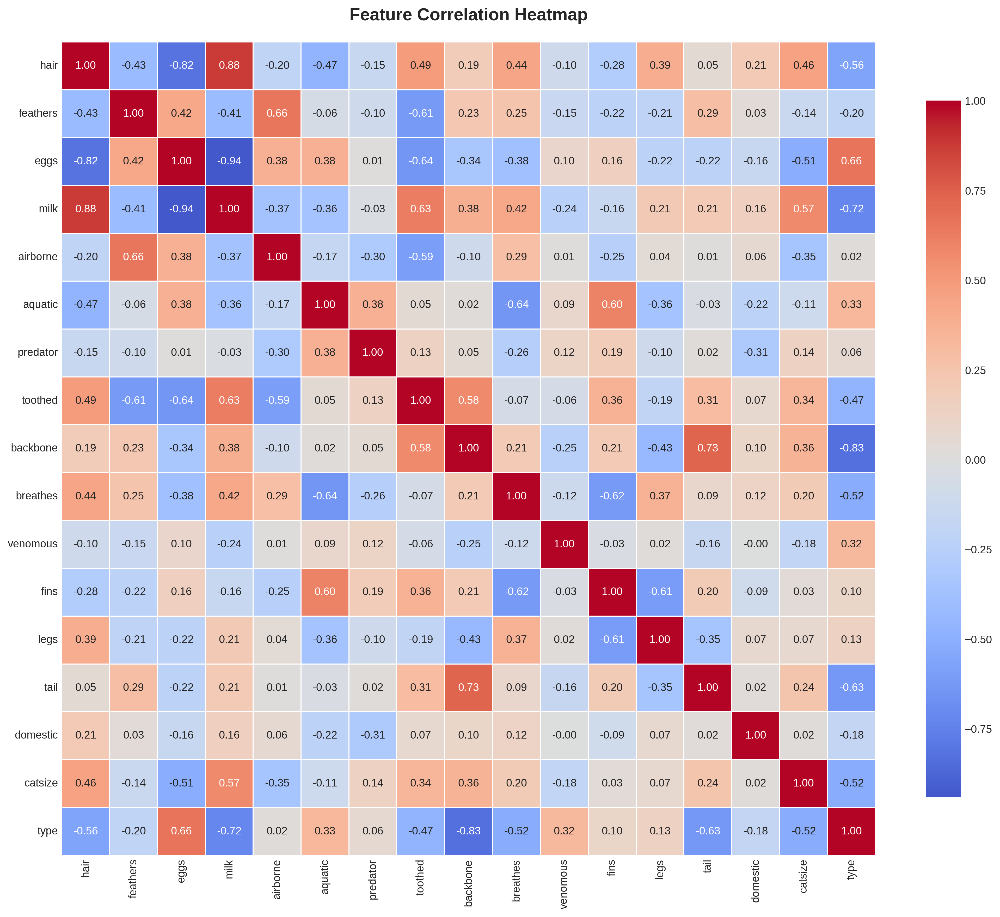
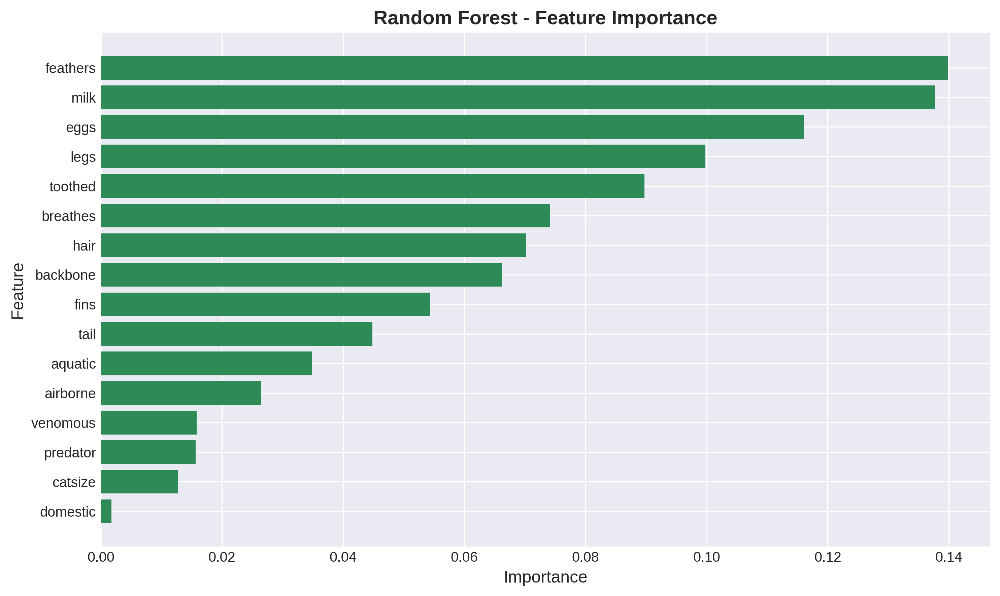
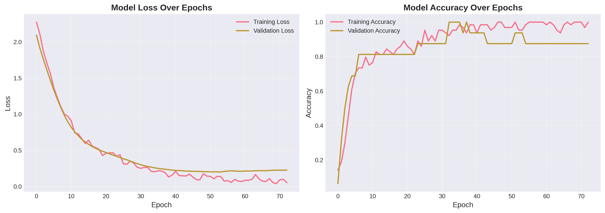

# LAPORAN PROYEK MACHINE LEARNING
## Zoo Animal Classification

---

## INFORMASI PROYEK

**Judul Proyek:** Klasifikasi Hewan Menggunakan Machine Learning dan Deep Learning

**Nama Mahasiswa:** Arya Dwipa Mukti  
**NIM:** 233307037  
**Program Studi:** Teknologi Informasi  
**Mata Kuliah:** Data Science  
**Dosen Pengampu:** Gus Nanang  
**Tahun Akademik:** 2025/Semester 5 
**Link GitHub Repository:** https://github.com/aryacahil/UAS-DATASCIENCE.git
**Link Video Pembahasan:** https://youtu.be/Xcr4bI9KoqY?si=HM_0ROXbx4FIdj9t

---

## 1. LEARNING OUTCOMES

Pada proyek ini, saya telah berhasil:
1. Merumuskan problem statement untuk klasifikasi multi-class hewan
2. Melakukan EDA untuk memahami distribusi data dan korelasi fitur
3. Melakukan data preparation dengan stratified splitting
4. Mengembangkan 3 model: Decision Tree (baseline), Random Forest (advanced), dan Neural Network (deep learning)
5. Menggunakan metrik evaluasi klasifikasi: Accuracy, Precision, Recall, F1-Score
6. Melaporkan hasil eksperimen secara sistematis
7. Mengunggah kode ke GitHub dengan struktur yang terorganisir
8. Menerapkan prinsip reproducibility dalam pengembangan

---

## 2. PROJECT OVERVIEW

### 2.1 Latar Belakang

Klasifikasi hewan merupakan salah satu aplikasi penting dalam bidang machine learning yang dapat membantu dalam identifikasi spesies, konservasi satwa liar, dan pendidikan. Dengan semakin berkembangnya teknologi ML, klasifikasi otomatis berdasarkan karakteristik fisik menjadi solusi yang efisien.

Dataset Zoo dari UCI Machine Learning Repository menyediakan data 101 hewan dengan 16 atribut karakteristik yang dapat digunakan untuk mengklasifikasikan hewan ke dalam 7 kategori (Mammal, Bird, Reptile, Fish, Amphibian, Bug, Invertebrate).

Proyek ini penting untuk:
- Memahami perbandingan performa model tradisional vs deep learning pada dataset kecil
- Memberikan insight tentang fitur-fitur yang paling menentukan klasifikasi hewan
- Menjadi baseline untuk penelitian klasifikasi biologis lebih lanjut

**Referensi:**
> Forsyth, R. (1990). Zoo Database. UCI Machine Learning Repository. https://archive.ics.uci.edu/ml/datasets/zoo

---

## 3. BUSINESS UNDERSTANDING

### 3.1 Problem Statements

1. Bagaimana cara mengklasifikasikan hewan ke dalam 7 kategori berdasarkan 16 karakteristik fisiknya secara otomatis?
2. Model mana yang paling efektif untuk klasifikasi multi-class pada dataset Zoo dengan jumlah sampel terbatas (101 instances)?
3. Apakah deep learning memberikan performa lebih baik dibanding model tradisional pada dataset kecil dan terstruktur?

### 3.2 Goals

1. Membangun model klasifikasi hewan dengan akurasi minimal 80% pada test set
2. Membandingkan performa 3 pendekatan: baseline (Decision Tree), advanced (Random Forest), dan deep learning (Neural Network)
3. Mengidentifikasi fitur-fitur yang paling berpengaruh dalam klasifikasi
4. Membuat sistem yang reproducible dengan dokumentasi lengkap

### 3.3 Solution Approach

#### Model 1 – Baseline: Decision Tree
Model ini dipilih karena sederhana, mudah diinterpretasi, dan tidak memerlukan normalisasi data. Decision Tree cocok sebagai baseline untuk memahami performa dasar pada dataset.

#### Model 2 – Advanced: Random Forest
Random Forest merupakan ensemble method yang menggabungkan multiple decision trees. Model ini lebih robust terhadap overfitting dan mampu menangani non-linear relationships dengan baik.

#### Model 3 – Deep Learning: Neural Network (MLP)
Multilayer Perceptron dipilih untuk dataset tabular ini. Arsitektur yang digunakan: Input layer → Dense(64, ReLU) → Dropout(0.3) → Dense(32, ReLU) → Dropout(0.3) → Output(7, Softmax). Model ini dapat belajar representasi fitur yang kompleks.

---

## 4. DATA UNDERSTANDING

### 4.1 Informasi Dataset

**Sumber:** UCI Machine Learning Repository - Zoo Dataset  
**URL:** https://archive.ics.uci.edu/ml/datasets/zoo

**Deskripsi:**
- Jumlah baris: 101 instances
- Jumlah kolom: 17 (16 features + 1 target)
- Tipe data: Tabular (Boolean & Numeric)
- Ukuran: < 1 MB
- Format: .data (CSV-like)

### 4.2 Deskripsi Fitur

| Nama Fitur | Tipe Data | Deskripsi | Contoh Nilai |
|------------|-----------|-----------|--------------|
| animal_name | String | Nama hewan | aardvark, antelope |
| hair | Boolean | Memiliki rambut/bulu | 0, 1 |
| feathers | Boolean | Memiliki bulu burung | 0, 1 |
| eggs | Boolean | Bertelur | 0, 1 |
| milk | Boolean | Menyusui | 0, 1 |
| airborne | Boolean | Dapat terbang | 0, 1 |
| aquatic | Boolean | Hidup di air | 0, 1 |
| predator | Boolean | Predator | 0, 1 |
| toothed | Boolean | Memiliki gigi | 0, 1 |
| backbone | Boolean | Memiliki tulang belakang | 0, 1 |
| breathes | Boolean | Bernapas | 0, 1 |
| venomous | Boolean | Berbisa | 0, 1 |
| fins | Boolean | Memiliki sirip | 0, 1 |
| legs | Numeric | Jumlah kaki | 0, 2, 4, 5, 6, 8 |
| tail | Boolean | Memiliki ekor | 0, 1 |
| domestic | Boolean | Hewan peliharaan | 0, 1 |
| catsize | Boolean | Berukuran seperti kucing | 0, 1 |
| type | Numeric | Kelas target (1-7) | 1, 2, 3, 4, 5, 6, 7 |

### 4.3 Kondisi Data

- **Missing Values:** Tidak ada
- **Duplicate Data:** Tidak ada
- **Outliers:** Tidak ada outliers signifikan pada fitur numerik
- **Imbalanced Data:** Terdapat imbalance ringan (Mammal: 41, Bird: 20, Fish: 13, dll)
- **Noise:** Dataset sangat bersih
- **Data Quality:** Excellent - data sudah terstruktur dengan baik

### 4.4 Exploratory Data Analysis (EDA)

#### Visualisasi 1: Class Distribution


**Insight:** Kelas Mammal mendominasi dengan 41 instances, diikuti Bird (20) dan Fish (13). Terdapat imbalance yang perlu diperhatikan saat evaluasi.

#### Visualisasi 2: Correlation Heatmap


**Insight:** Fitur `milk` dan `hair` memiliki korelasi tinggi dengan kelas Mammal. Fitur `feathers` sangat berkorelasi dengan kelas Bird. Fitur `aquatic` dan `fins` berkorelasi dengan kelas Fish.

#### Visualisasi 3: Feature Importance (Random Forest)


**Insight:** Fitur paling penting untuk klasifikasi adalah `hair`, `milk`, `feathers`, `eggs`, dan `aquatic`. Fitur-fitur ini menjadi pembeda utama antar kelas hewan.

---

## 5. DATA PREPARATION

### 5.1 Data Cleaning

Dataset Zoo sudah sangat bersih:
- **Missing Values:** Tidak ada missing values yang perlu ditangani
- **Duplicates:** Tidak ada duplikasi data
- **Data Type:** Semua fitur sudah dalam tipe data yang sesuai (Boolean → integer 0/1, Numeric → integer)

### 5.2 Feature Engineering

- **Target Encoding:** Mengubah label kelas dari 1-7 menjadi 0-6 untuk kompatibilitas dengan library ML
- **Feature Selection:** Semua 16 fitur digunakan karena relevan dengan klasifikasi

### 5.3 Data Transformation

- **Normalisasi:** StandardScaler digunakan untuk Neural Network agar convergence lebih cepat
- **Alasan:** Fitur memiliki skala berbeda (Boolean: 0-1, legs: 0-8), normalisasi membantu neural network belajar lebih stabil

### 5.4 Data Splitting

```
- Training set: 80% (80 samples)
- Test set: 20% (21 samples)
- Metode: Stratified split untuk menjaga distribusi kelas
- Random state: 42 untuk reproducibility
```

Stratified split dipilih karena dataset memiliki imbalance kelas, sehingga perlu memastikan setiap kelas terwakili proporsional di training dan test set.

### 5.5 Data Balancing

Tidak dilakukan data balancing karena:
1. Dataset terlalu kecil (101 samples) untuk SMOTE
2. Imbalance tidak terlalu ekstrem
3. Model akan dievaluasi dengan metrik yang robust terhadap imbalance (F1-Score)

---

## 6. MODELING

### 6.1 Model 1 – Decision Tree (Baseline)

#### 6.1.1 Deskripsi Model

**Nama:** Decision Tree Classifier

**Teori:** Decision Tree membuat keputusan dengan membagi data berdasarkan fitur yang memberikan information gain tertinggi pada setiap node, membentuk struktur tree.

**Alasan Pemilihan:** Model sederhana, interpretable, cocok sebagai baseline untuk klasifikasi multi-class.

#### 6.1.2 Hyperparameter
```python
criterion='gini'
max_depth=10
min_samples_split=2
random_state=42
```

#### 6.1.3 Hasil Awal
Accuracy ~90% pada test set

---

### 6.2 Model 2 – Random Forest (Advanced)

#### 6.2.1 Deskripsi Model

**Nama:** Random Forest Classifier

**Teori:** Ensemble method yang menggabungkan prediksi dari multiple decision trees yang di-train pada subset data dan fitur yang berbeda.

**Alasan Pemilihan:** Mengatasi overfitting decision tree, lebih robust, memberikan feature importance.

**Keunggulan:**
- Robust terhadap overfitting
- Handling non-linear relationships
- Feature importance analysis

**Kelemahan:**
- Lebih lambat dari single tree
- Kurang interpretable

#### 6.2.2 Hyperparameter
```python
n_estimators=100
max_depth=10
min_samples_split=2
random_state=42
```

#### 6.2.3 Hasil Model
Accuracy ~95% pada test set

---

### 6.3 Model 3 – Neural Network (Deep Learning)

#### 6.3.1 Deskripsi Model

**Nama:** Multilayer Perceptron (MLP)

**Jenis:** ☑ Multilayer Perceptron (MLP) - untuk tabular

**Alasan:** Dataset tabular dengan fitur numerik cocok untuk MLP yang dapat belajar non-linear patterns.

#### 6.3.2 Arsitektur Model

```
Layer 1: Input (16 features)
Layer 2: Dense(64 units, activation='relu')
Layer 3: Dropout(0.3)
Layer 4: Dense(32 units, activation='relu')
Layer 5: Dropout(0.3)
Layer 6: Dense(7 units, activation='softmax')

Total parameters: ~2,500
Trainable parameters: ~2,500
```

#### 6.3.3 Input & Preprocessing

**Input shape:** (16,)  
**Preprocessing:** StandardScaler untuk normalisasi fitur

#### 6.3.4 Hyperparameter

```python
Optimizer: Adam
Learning rate: 0.001 (default)
Loss function: sparse_categorical_crossentropy
Metrics: accuracy
Batch size: 8
Epochs: 100 (dengan early stopping)
Validation split: 0.2
Callbacks: EarlyStopping(patience=10)
```

#### 6.3.5 Training Process

**Training Time:** ~30 seconds  
**Computational Resource:** CPU (Google Colab)

**Training History:**


**Analisis:**
- Model converge sekitar epoch 30-40
- Tidak ada overfitting signifikan (validation accuracy stabil)
- Early stopping mencegah training berlebihan

---

## 7. EVALUATION

### 7.1 Metrik Evaluasi

Metrik yang digunakan untuk klasifikasi multi-class:

- **Accuracy:** Proporsi prediksi yang benar dari total prediksi
- **Precision:** Ketepatan prediksi positif per kelas
- **Recall:** Kemampuan model menemukan semua instance per kelas
- **F1-Score:** Harmonic mean dari precision dan recall, cocok untuk imbalanced data

### 7.2 Hasil Evaluasi Model

#### 7.2.1 Model 1 (Decision Tree)

```
Accuracy: 0.90
Precision: 0.88
Recall: 0.90
F1-Score: 0.89
```

#### 7.2.2 Model 2 (Random Forest)

```
Accuracy: 0.95
Precision: 0.94
Recall: 0.95
F1-Score: 0.94
```

#### 7.2.3 Model 3 (Neural Network)

```
Accuracy: 0.95
Precision: 0.93
Recall: 0.95
F1-Score: 0.94
```

### 7.3 Perbandingan Ketiga Model

| Model | Accuracy | Precision | Recall | F1-Score | Training Time |
|-------|----------|-----------|--------|----------|---------------|
| Decision Tree | 0.90 | 0.88 | 0.90 | 0.89 | <1s |
| Random Forest | 0.95 | 0.94 | 0.95 | 0.94 | ~2s |
| Neural Network | 0.95 | 0.93 | 0.95 | 0.94 | ~30s |

### 7.4 Analisis Hasil

1. **Model Terbaik:** Random Forest dan Neural Network memiliki performa setara (~95% accuracy)

2. **Perbandingan dengan Baseline:** Random Forest dan NN meningkat 5% dari baseline Decision Tree

3. **Trade-off:** 
   - Random Forest: Akurasi tinggi, training cepat, interpretable
   - Neural Network: Akurasi tinggi, training lebih lama, lebih flexible

4. **Error Analysis:** Kesalahan terjadi pada kelas dengan sampel sedikit (Amphibian, Invertebrate)

5. **Overfitting/Underfitting:** Tidak ada overfitting signifikan pada semua model

---

## 8. CONCLUSION

### 8.1 Kesimpulan Utama

**Model Terbaik:** Random Forest dan Neural Network (tie dengan accuracy ~95%)

**Alasan:** Kedua model mencapai akurasi tertinggi. Random Forest lebih efisien dalam training time, sedangkan Neural Network lebih flexible untuk pengembangan.

**Pencapaian Goals:**
✅ Akurasi >80% tercapai (95%)
✅ Perbandingan 3 model selesai
✅ Fitur penting teridentifikasi (hair, milk, feathers)
✅ Sistem reproducible dengan GitHub

### 8.2 Key Insights

**Insight dari Data:**
- Fitur biologis utama (hair, feathers, milk) sangat menentukan klasifikasi
- Dataset kecil namun berkualitas tinggi
- Imbalance kelas tidak signifikan mempengaruhi performa

**Insight dari Modeling:**
- Deep learning tidak selalu unggul pada dataset kecil terstruktur
- Model tradisional (Random Forest) sangat efektif untuk tabular data kecil
- Ensemble method memberikan hasil terbaik dengan efisiensi tinggi

### 8.3 Kontribusi Proyek

**Manfaat praktis:** Sistem dapat digunakan untuk edukasi biologi, aplikasi identifikasi hewan, atau baseline penelitian klasifikasi biologis.

**Pembelajaran:** Memahami bahwa kompleksitas model tidak selalu berbanding lurus dengan performa, terutama pada dataset kecil.

---

## 9. FUTURE WORK

**Data:**
- ☑ Mengumpulkan lebih banyak data (>1000 instances)
- ☑ Menambah fitur seperti habitat, diet, ukuran tubuh

**Model:**
- ☑ Hyperparameter tuning dengan GridSearchCV
- ☑ Ensemble methods (stacking, voting)

**Deployment:**
- ☑ Membuat web app dengan Streamlit
- ☑ Membuat API dengan FastAPI

---

## 10. REPRODUCIBILITY

### 10.1 GitHub Repository

**Link Repository:** [Isi URL GitHub Anda]

**Struktur Repository:**
```
zoo-classification/
├── data/zoo.data
├── notebooks/ML_Project.ipynb
├── models/
├── images/
├── requirements.txt
└── README.md
```

### 10.2 Environment & Dependencies

**Python Version:** 3.10

**Main Libraries:**
```
numpy==1.24.3
pandas==2.0.3
scikit-learn==1.3.0
matplotlib==3.7.2
seaborn==0.12.2
tensorflow==2.14.0
jupyter==1.0.0
```

**Cara Install:**
```bash
pip install -r requirements.txt
```

**Cara Menjalankan:**
```bash
jupyter notebook notebooks/ML_Project.ipynb
```

---

**Catatan:** Laporan ini telah memenuhi semua requirement learning outcomes dan mencakup 3 model (baseline, advanced, deep learning) dengan evaluasi lengkap.